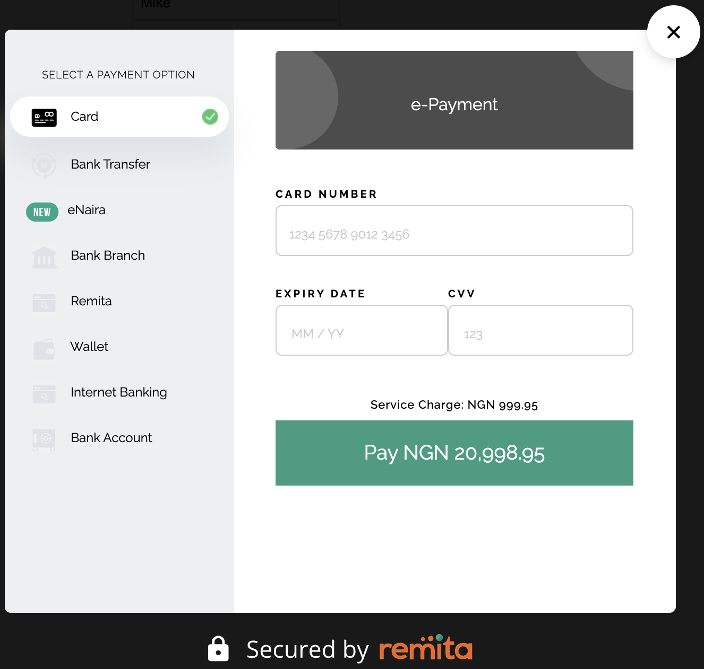

# Remita Inline Sample
> Our Web library lets you easily accept payments inside any web application.




## Usage

Look at the sample Remita Inline Sample HTML file [remita-inline-sample.html](remita-inline-sample.html)

You can change the key to the one assigned to you.

You can obtain your API keys by signing up on [https://remita.net](https://remita.net) as an integrator.

## Development setup

Integrating Remita Inline Checkout is as easy as including our JavaScript library at the bottom of the page where your checkout form is located.

```sh
<form>
    <script src="https://remitademo.net/payment/v1/remita-pay-inline.bundle.js"></script>
    <button type="button" onclick="makePayment()"> Pay </button> 
</form>
<script>
    function makePayment() {
        var paymentEngine = RmPaymentEngine.init({
            key: 'public key',
            customerId: "140700251",
            firstName: "Lisa",
            lastName: "Spark",
            email: "demo@remita.net",
            amount: 19999,
            onSuccess: function (response) {
                console.log('callback Successful Response', response);
            },
            onError: function (response) {
                console.log('callback Error Response', response);
            },
            onClose: function () {
                console.log("closed");
            }
        });
    
        paymentEngine.showPaymentWidget();
    }
</script>

```
## Documentation
[Remita Documentation](https://remita.net/developers/)

## Release History

* 0.1.1
    * CHANGE: Update docs
* 0.1.0
    * The first proper release
* 0.0.1
    * Work in progress
